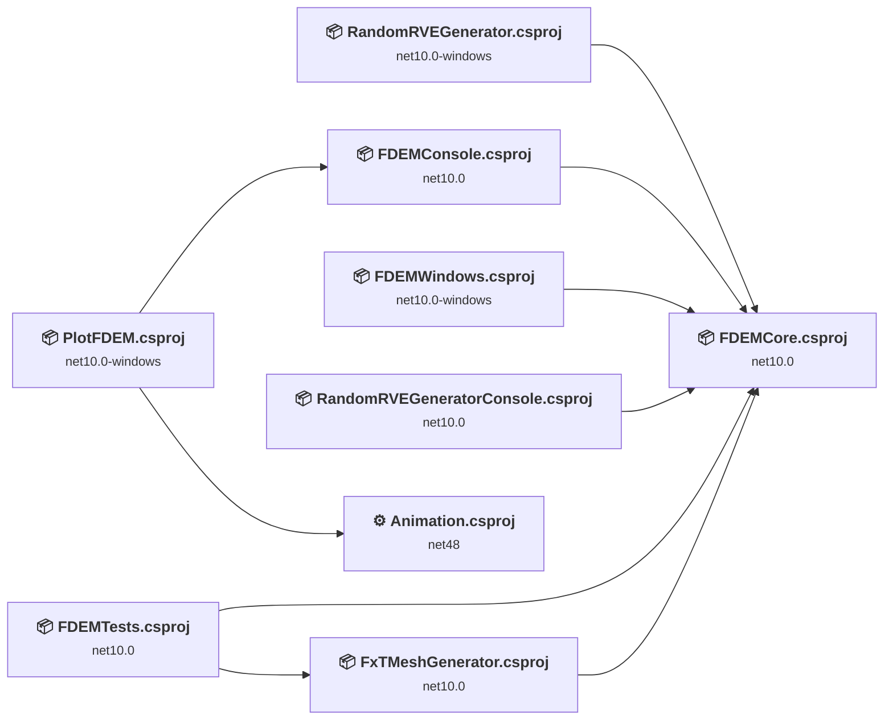
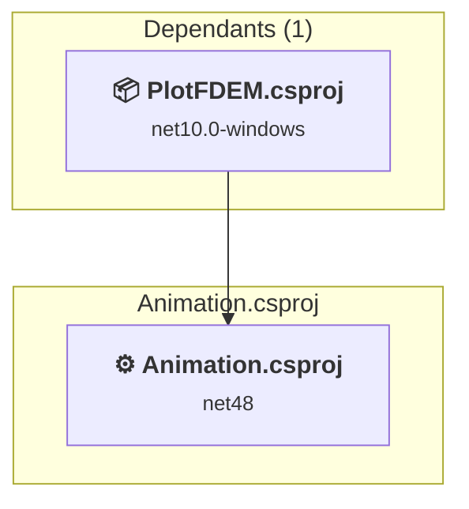
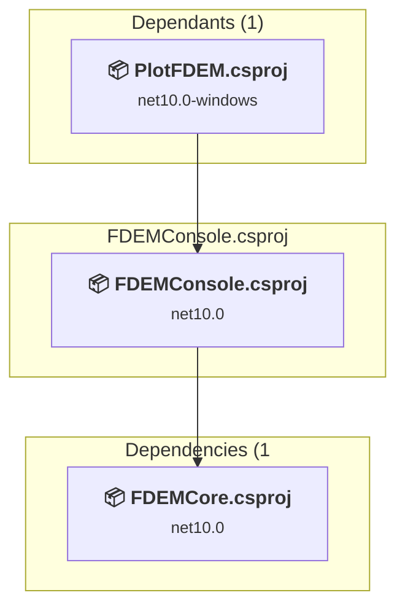
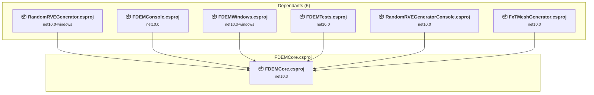
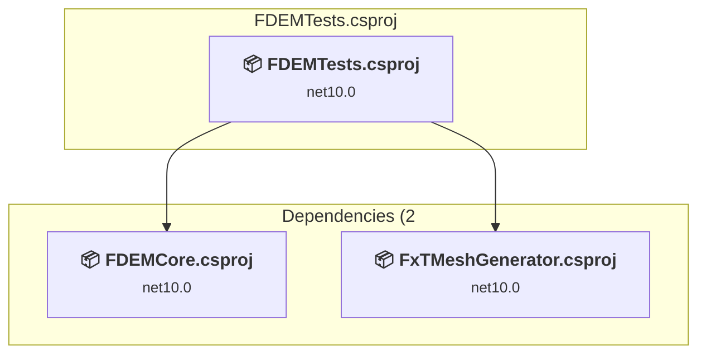
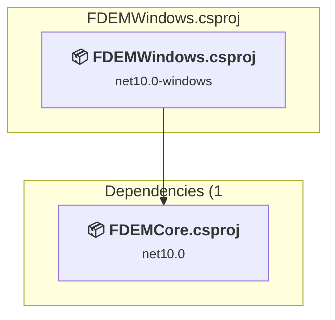
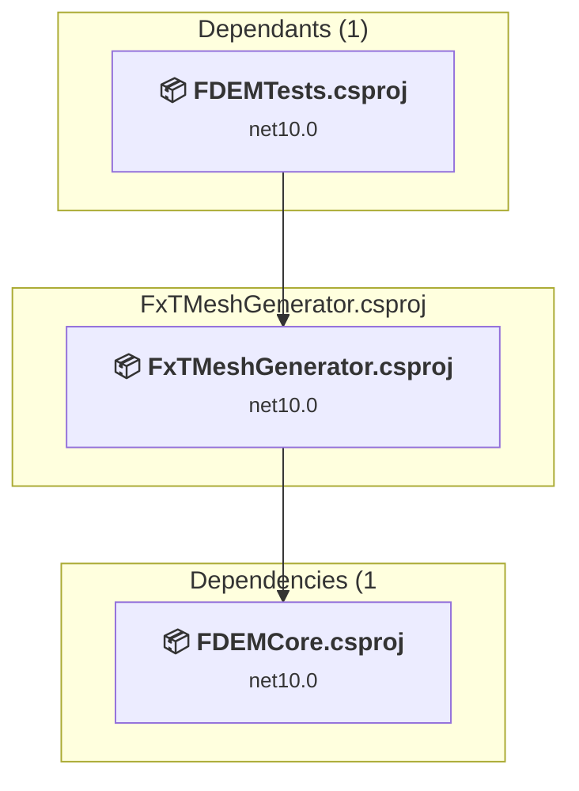
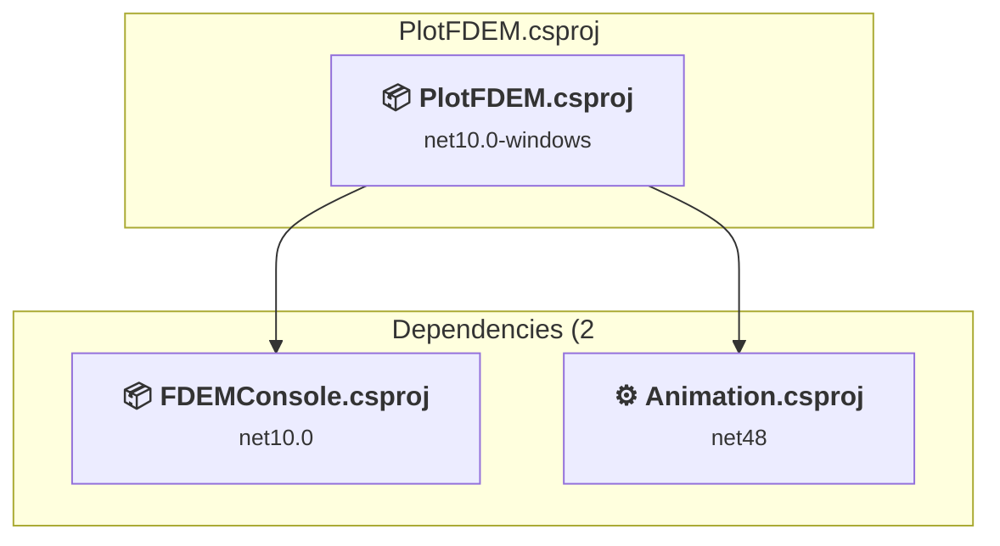
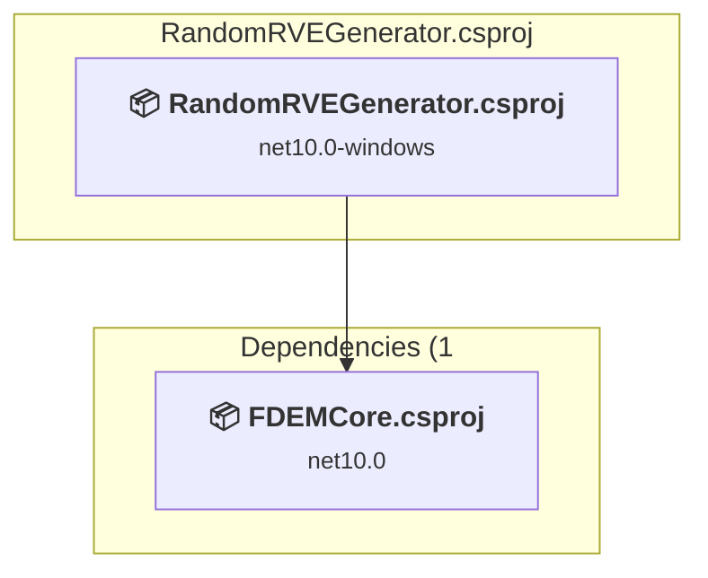
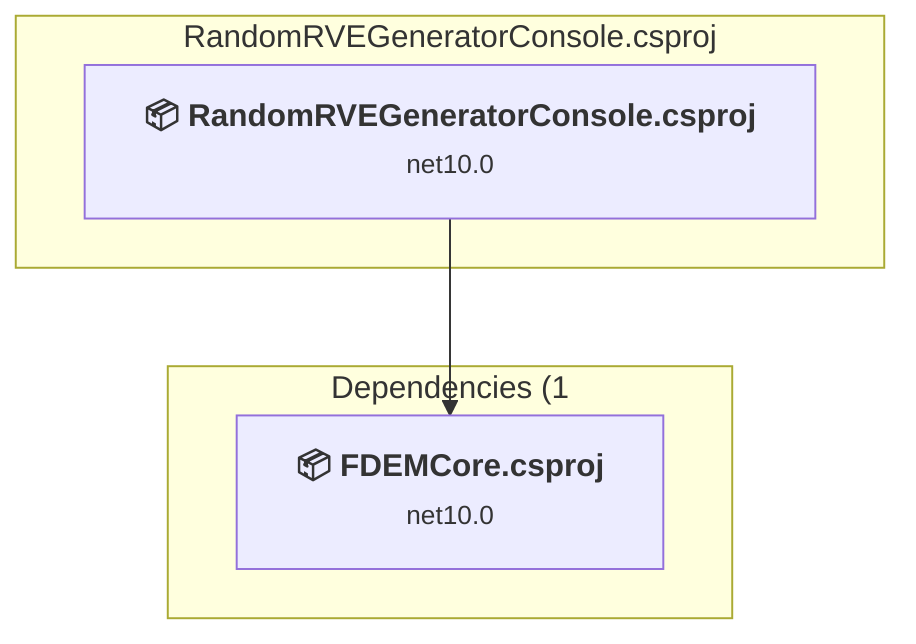

# Projects and dependencies analysis

This document provides a comprehensive overview of the projects and their dependencies in the context of upgrading to .NETCoreApp,Version=v10.0.

## Table of Contents

- [Executive Summary](#executive-Summary)
  - [Highlevel Metrics](#highlevel-metrics)
  - [Projects Compatibility](#projects-compatibility)
  - [Package Compatibility](#package-compatibility)
  - [API Compatibility](#api-compatibility)
  - [Binding Redirect Configuration](#binding-redirect-configuration)
- [Aggregate NuGet packages details](#aggregate-nuget-packages-details)
- [Top API Migration Challenges](#top-api-migration-challenges)
  - [Technologies and Features](#technologies-and-features)
  - [Most Frequent API Issues](#most-frequent-api-issues)
- [Projects Relationship Graph](#projects-relationship-graph)
- [Project Details](#project-details)

  - [animation\animation\Animation.csproj](#animationanimationanimationcsproj)
  - [FDEMConsole\FDEMConsole.csproj](#fdemconsolefdemconsolecsproj)
  - [FDEMCore\FDEMCore.csproj](#fdemcorefdemcorecsproj)
  - [FDEMTests\FDEMTests.csproj](#fdemtestsfdemtestscsproj)
  - [FDEMWindows\FDEMWindows.csproj](#fdemwindowsfdemwindowscsproj)
  - [FxTMeshGenerator\FxTMeshGenerator.csproj](#fxtmeshgeneratorfxtmeshgeneratorcsproj)
  - [PlotFDEM\PlotFDEM.csproj](#plotfdemplotfdemcsproj)
  - [RandomRVEGenerator\RandomRVEGenerator.csproj](#randomrvegeneratorrandomrvegeneratorcsproj)
  - [RandomRVEGeneratorConsole\RandomRVEGeneratorConsole.csproj](#randomrvegeneratorconsolerandomrvegeneratorconsolecsproj)

## Executive Summary

### Highlevel Metrics

| Metric | Count | Status |
| :--- | :---: | :--- |
| Total Projects | 9 | 1 require upgrade |
| Total NuGet Packages | 12 | 1 need upgrade |
| Total Code Files | 123 |  |
| Total Code Files with Incidents | 5 |  |
| Total Lines of Code | 30987 |  |
| Total Number of Issues | 1053 |  |
| Estimated LOC to modify | 1046+ | at least 3.4% of codebase |

### Projects Compatibility

| Project | Target Framework | Difficulty | Package Issues | API Issues | Binding Issues | Est. LOC Impact | Description |
| :--- | :---: | :---: | :---: | :---: | :---: | :---: | :--- |
| [animation\animation\Animation.csproj](#animationanimationanimationcsproj) | net48 | 🟡 Medium | 1 | 1046 | 4 | 1046+ | ClassicWinForms, Sdk Style = False |
| [FDEMConsole\FDEMConsole.csproj](#fdemconsolefdemconsolecsproj) | net10.0 | ✅ None | 0 | 0 | 0 |  | DotNetCoreApp, Sdk Style = True |
| [FDEMCore\FDEMCore.csproj](#fdemcorefdemcorecsproj) | net10.0 | ✅ None | 0 | 0 | 0 |  | ClassLibrary, Sdk Style = True |
| [FDEMTests\FDEMTests.csproj](#fdemtestsfdemtestscsproj) | net10.0 | ✅ None | 0 | 0 | 0 |  | DotNetCoreApp, Sdk Style = True |
| [FDEMWindows\FDEMWindows.csproj](#fdemwindowsfdemwindowscsproj) | net10.0-windows | ✅ None | 0 | 0 | 0 |  | WinForms, Sdk Style = True |
| [FxTMeshGenerator\FxTMeshGenerator.csproj](#fxtmeshgeneratorfxtmeshgeneratorcsproj) | net10.0 | ✅ None | 0 | 0 | 0 |  | DotNetCoreApp, Sdk Style = True |
| [PlotFDEM\PlotFDEM.csproj](#plotfdemplotfdemcsproj) | net10.0-windows | ✅ None | 0 | 0 | 0 |  | WinForms, Sdk Style = True |
| [RandomRVEGenerator\RandomRVEGenerator.csproj](#randomrvegeneratorrandomrvegeneratorcsproj) | net10.0-windows | ✅ None | 0 | 0 | 0 |  | WinForms, Sdk Style = True |
| [RandomRVEGeneratorConsole\RandomRVEGeneratorConsole.csproj](#randomrvegeneratorconsolerandomrvegeneratorconsolecsproj) | net10.0 | ✅ None | 0 | 0 | 0 |  | DotNetCoreApp, Sdk Style = True |

### Package Compatibility

| Status | Count | Percentage |
| :--- | :---: | :---: |
| ✅ Compatible | 11 | 91.7% |
| ⚠️ Incompatible | 0 | 0.0% |
| 🔄 Upgrade Recommended | 1 | 8.3% |
| ***Total NuGet Packages*** | ***12*** | ***100%*** |

### API Compatibility

| Category | Count | Impact |
| :--- | :---: | :--- |
| 🔴 Binary Incompatible | 917 | High - Require code changes |
| 🟡 Source Incompatible | 129 | Medium - Needs re-compilation and potential conflicting API error fixing |
| 🔵 Behavioral change | 0 | Low - Behavioral changes that may require testing at runtime |
| ✅ Compatible | 1329 |  |
| ***Total APIs Analyzed*** | ***2375*** |  |

### Binding Redirect Configuration

| Severity | Count | Description |
| :--- | :---: | :--- |
| 🔴Mandatory | 1 | Must be fixed to avoid runtime failures |
| 🟡Potential | 3 | May cause issues in certain scenarios |
| ***Total Binding Issues*** | ***4*** | ***Across 1 project(s)*** |

## Aggregate NuGet packages details

| Package | Current Version | Suggested Version | Projects | Description |
| :--- | :---: | :---: | :--- | :--- |
| AnimatedGif | 1.0.5 |  | [Animation.csproj](#animationanimationanimationcsproj) | ✅Compatible |
| coverlet.collector | 6.0.4 |  | [FDEMTests.csproj](#fdemtestsfdemtestscsproj) | ✅Compatible |
| Delaunator | 1.0.11 |  | [FDEMCore.csproj](#fdemcorefdemcorecsproj) [FxTMeshGenerator.csproj](#fxtmeshgeneratorfxtmeshgeneratorcsproj) | ✅Compatible |
| Microsoft.DotNet.UpgradeAssistant.Extensions.Default.Analyzers | 0.4.421302 |  | [RandomRVEGenerator.csproj](#randomrvegeneratorrandomrvegeneratorcsproj) | ✅Compatible |
| Microsoft.NET.Test.Sdk | 17.14.1 |  | [FDEMTests.csproj](#fdemtestsfdemtestscsproj) | ✅Compatible |
| NUnit | 4.4.0 |  | [FDEMTests.csproj](#fdemtestsfdemtestscsproj) | ✅Compatible |
| NUnit3TestAdapter | 5.1.0 |  | [FDEMTests.csproj](#fdemtestsfdemtestscsproj) | ✅Compatible |
| SinglePlotZedGraph | 1.0.0 |  | [FDEMWindows.csproj](#fdemwindowsfdemwindowscsproj) [PlotFDEM.csproj](#plotfdemplotfdemcsproj) | ✅Compatible |
| StapletonMathPackage | 1.3.4 |  | [FDEMCore.csproj](#fdemcorefdemcorecsproj) | ✅Compatible |
| System.Configuration.ConfigurationManager | 10.0.0 |  | [RandomRVEGenerator.csproj](#randomrvegeneratorrandomrvegeneratorcsproj) | ✅Compatible |
| System.Drawing.Common | 4.7.2 | 10.0.10 | [Animation.csproj](#animationanimationanimationcsproj) | NuGet package upgrade is recommended |
| ZedGraph | 5.2.0 |  | [Animation.csproj](#animationanimationanimationcsproj) [PlotFDEM.csproj](#plotfdemplotfdemcsproj) | ✅Compatible |

## Top API Migration Challenges

### Technologies and Features

| Technology | Issues | Percentage | Migration Path |
| :--- | :---: | :---: | :--- |
| Windows Forms | 917 | 87.7% | Windows Forms APIs for building Windows desktop applications with traditional Forms-based UI that are available in .NET on Windows. Enable Windows Desktop support: Option 1 (Recommended): Target net9.0-windows; Option 2: Add <UseWindowsDesktop>true</UseWindowsDesktop>; Option 3 (Legacy): Use Microsoft.NET.Sdk.WindowsDesktop SDK. |
| GDI+ / System.Drawing | 129 | 12.3% | System.Drawing APIs for 2D graphics, imaging, and printing that are available via NuGet package System.Drawing.Common. Note: Not recommended for server scenarios due to Windows dependencies; consider cross-platform alternatives like SkiaSharp or ImageSharp for new code. |
| Windows Forms Legacy Controls | 1 | 0.1% | Legacy Windows Forms controls that have been removed from .NET Core/5+ including StatusBar, DataGrid, ContextMenu, MainMenu, MenuItem, and ToolBar. These controls were replaced by more modern alternatives. Use ToolStrip, MenuStrip, ContextMenuStrip, and DataGridView instead. |

### Most Frequent API Issues

| API | Count | Percentage | Category |
| :--- | :---: | :---: | :--- |
| T:System.Windows.Forms.Button | 179 | 17.1% | Binary Incompatible |
| T:System.Windows.Forms.Label | 34 | 3.3% | Binary Incompatible |
| T:System.Windows.Forms.NumericUpDown | 31 | 3.0% | Binary Incompatible |
| T:System.Windows.Forms.AnchorStyles | 25 | 2.4% | Binary Incompatible |
| T:System.Windows.Forms.FlatStyle | 24 | 2.3% | Binary Incompatible |
| T:System.Windows.Forms.ImageLayout | 24 | 2.3% | Binary Incompatible |
| P:System.Windows.Forms.Control.Name | 23 | 2.2% | Binary Incompatible |
| P:System.Windows.Forms.Control.Size | 22 | 2.1% | Binary Incompatible |
| T:System.Windows.Forms.Control.ControlCollection | 21 | 2.0% | Binary Incompatible |
| P:System.Windows.Forms.Control.Controls | 21 | 2.0% | Binary Incompatible |
| M:System.Windows.Forms.Control.ControlCollection.Add(System.Windows.Forms.Control) | 21 | 2.0% | Binary Incompatible |
| P:System.Windows.Forms.Control.TabIndex | 21 | 2.0% | Binary Incompatible |
| P:System.Windows.Forms.Control.Location | 21 | 2.0% | Binary Incompatible |
| T:System.Windows.Forms.SplitContainer | 20 | 1.9% | Binary Incompatible |
| T:System.Windows.Forms.TrackBar | 19 | 1.8% | Binary Incompatible |
| T:System.Windows.Forms.ControlStyles | 16 | 1.5% | Binary Incompatible |
| T:System.Drawing.Drawing2D.MatrixOrder | 12 | 1.1% | Source Incompatible |
| E:System.Windows.Forms.Control.Click | 12 | 1.1% | Binary Incompatible |
| P:System.Windows.Forms.ButtonBase.UseVisualStyleBackColor | 12 | 1.1% | Binary Incompatible |
| M:System.Windows.Forms.Button.#ctor | 12 | 1.1% | Binary Incompatible |
| P:System.Windows.Forms.Control.Width | 11 | 1.1% | Binary Incompatible |
| P:System.Windows.Forms.Control.Height | 11 | 1.1% | Binary Incompatible |
| T:System.Windows.Forms.DialogResult | 11 | 1.1% | Binary Incompatible |
| T:System.Windows.Forms.ContextMenuStrip | 11 | 1.1% | Binary Incompatible |
| T:System.Drawing.Graphics | 10 | 1.0% | Source Incompatible |
| T:System.Drawing.Bitmap | 9 | 0.9% | Source Incompatible |
| T:System.Windows.Forms.Timer | 9 | 0.9% | Binary Incompatible |
| M:System.Windows.Forms.Control.SetStyle(System.Windows.Forms.ControlStyles,System.Boolean) | 8 | 0.8% | Binary Incompatible |
| T:System.Windows.Forms.SplitterPanel | 8 | 0.8% | Binary Incompatible |
| P:System.Windows.Forms.Control.Tag | 8 | 0.8% | Binary Incompatible |
| T:System.Drawing.Image | 8 | 0.8% | Source Incompatible |
| P:System.Windows.Forms.ButtonBase.Image | 8 | 0.8% | Binary Incompatible |
| F:System.Windows.Forms.FlatStyle.Flat | 8 | 0.8% | Binary Incompatible |
| P:System.Windows.Forms.ButtonBase.FlatStyle | 8 | 0.8% | Binary Incompatible |
| T:System.Windows.Forms.FlatButtonAppearance | 8 | 0.8% | Binary Incompatible |
| P:System.Windows.Forms.ButtonBase.FlatAppearance | 8 | 0.8% | Binary Incompatible |
| P:System.Windows.Forms.FlatButtonAppearance.BorderSize | 8 | 0.8% | Binary Incompatible |
| F:System.Windows.Forms.ImageLayout.None | 8 | 0.8% | Binary Incompatible |
| P:System.Windows.Forms.Control.BackgroundImageLayout | 8 | 0.8% | Binary Incompatible |
| P:System.Windows.Forms.ButtonBase.BackColor | 8 | 0.8% | Binary Incompatible |
| T:System.Windows.Forms.ToolStripMenuItem | 7 | 0.7% | Binary Incompatible |
| F:System.Drawing.Drawing2D.MatrixOrder.Append | 6 | 0.6% | Source Incompatible |
| T:System.Drawing.Imaging.PixelFormat | 6 | 0.6% | Source Incompatible |
| M:System.Windows.Forms.Control.Invalidate | 6 | 0.6% | Binary Incompatible |
| P:System.Windows.Forms.NumericUpDown.Value | 5 | 0.5% | Binary Incompatible |
| P:System.Windows.Forms.Control.Enabled | 5 | 0.5% | Binary Incompatible |
| P:System.Windows.Forms.SplitContainer.Panel2 | 5 | 0.5% | Binary Incompatible |
| P:System.Windows.Forms.Control.ForeColor | 5 | 0.5% | Binary Incompatible |
| T:System.Drawing.Drawing2D.Matrix | 4 | 0.4% | Source Incompatible |
| M:System.Drawing.Graphics.FromImage(System.Drawing.Image) | 4 | 0.4% | Source Incompatible |

## Projects Relationship Graph

Legend:
📦 SDK-style project
⚙️ Classic project

## Project Details

### animation\animation\Animation.csproj

#### Project Info

- **Current Target Framework:** net48
- **Proposed Target Framework:** net10.0-windows
- **SDK-style**: False
- **Project Kind:** ClassicWinForms
- **Dependencies**: 0
- **Dependants**: 1
- **Number of Files**: 6
- **Number of Files with Incidents**: 5
- **Lines of Code**: 1284
- **Estimated LOC to modify**: 1046+ (at least 81.5% of the project)

#### Dependency Graph

Legend:
📦 SDK-style project
⚙️ Classic project

### API Compatibility

| Category | Count | Impact |
| :--- | :---: | :--- |
| 🔴 Binary Incompatible | 917 | High - Require code changes |
| 🟡 Source Incompatible | 129 | Medium - Needs re-compilation and potential conflicting API error fixing |
| 🔵 Behavioral change | 0 | Low - Behavioral changes that may require testing at runtime |
| ✅ Compatible | 1329 |  |
| ***Total APIs Analyzed*** | ***2375*** |  |

#### Binding Redirect Configuration

| Rule | Severity | Details | Recommendation |
| :--- | :---: | :--- | :--- |
| Missing binding redirect for referenced assembly | 🟡Potential | Manual redirects exist but none covers AnimatedGif (referenced v1.0.5.0, package v1.0.5) | Add a binding redirect for the missing assembly. |
| Missing binding redirect for referenced assembly | 🟡Potential | Manual redirects exist but none covers ZedGraph (referenced v5.2.0.439, package v5.2.0) | Add a binding redirect for the missing assembly. |
| Manual redirect conflicts with auto-generated version | 🔴Mandatory | Manual redirect for System.Drawing.Common targets 4.0.0.2 but auto-generation would target 4.7.2 (MSB3836 conflict) | Remove the conflicting manual binding redirect or disable auto-generation. |
| Binding redirect forces version downgrade | 🟡Potential | Binding redirect for System.Drawing.Common targets 4.0.0.2 but package provides 4.7.2 | Update the binding redirect newVersion to match the version provided by the NuGet package. |

#### Project Technologies and Features

| Technology | Issues | Percentage | Migration Path |
| :--- | :---: | :---: | :--- |
| Windows Forms Legacy Controls | 1 | 0.1% | Legacy Windows Forms controls that have been removed from .NET Core/5+ including StatusBar, DataGrid, ContextMenu, MainMenu, MenuItem, and ToolBar. These controls were replaced by more modern alternatives. Use ToolStrip, MenuStrip, ContextMenuStrip, and DataGridView instead. |
| GDI+ / System.Drawing | 129 | 12.3% | System.Drawing APIs for 2D graphics, imaging, and printing that are available via NuGet package System.Drawing.Common. Note: Not recommended for server scenarios due to Windows dependencies; consider cross-platform alternatives like SkiaSharp or ImageSharp for new code. |
| Windows Forms | 917 | 87.7% | Windows Forms APIs for building Windows desktop applications with traditional Forms-based UI that are available in .NET on Windows. Enable Windows Desktop support: Option 1 (Recommended): Target net9.0-windows; Option 2: Add <UseWindowsDesktop>true</UseWindowsDesktop>; Option 3 (Legacy): Use Microsoft.NET.Sdk.WindowsDesktop SDK. |

### FDEMConsole\FDEMConsole.csproj

#### Project Info

- **Current Target Framework:** net10.0✅
- **SDK-style**: True
- **Project Kind:** DotNetCoreApp
- **Dependencies**: 1
- **Dependants**: 1
- **Number of Files**: 1
- **Lines of Code**: 128
- **Estimated LOC to modify**: 0+ (at least 0.0% of the project)

#### Dependency Graph

Legend:
📦 SDK-style project
⚙️ Classic project

### API Compatibility

| Category | Count | Impact |
| :--- | :---: | :--- |
| 🔴 Binary Incompatible | 0 | High - Require code changes |
| 🟡 Source Incompatible | 0 | Medium - Needs re-compilation and potential conflicting API error fixing |
| 🔵 Behavioral change | 0 | Low - Behavioral changes that may require testing at runtime |
| ✅ Compatible | 0 |  |
| ***Total APIs Analyzed*** | ***0*** |  |

### FDEMCore\FDEMCore.csproj

#### Project Info

- **Current Target Framework:** net10.0✅
- **SDK-style**: True
- **Project Kind:** ClassLibrary
- **Dependencies**: 0
- **Dependants**: 6
- **Number of Files**: 59
- **Lines of Code**: 16940
- **Estimated LOC to modify**: 0+ (at least 0.0% of the project)

#### Dependency Graph

Legend:
📦 SDK-style project
⚙️ Classic project

### API Compatibility

| Category | Count | Impact |
| :--- | :---: | :--- |
| 🔴 Binary Incompatible | 0 | High - Require code changes |
| 🟡 Source Incompatible | 0 | Medium - Needs re-compilation and potential conflicting API error fixing |
| 🔵 Behavioral change | 0 | Low - Behavioral changes that may require testing at runtime |
| ✅ Compatible | 0 |  |
| ***Total APIs Analyzed*** | ***0*** |  |

### FDEMTests\FDEMTests.csproj

#### Project Info

- **Current Target Framework:** net10.0✅
- **SDK-style**: True
- **Project Kind:** DotNetCoreApp
- **Dependencies**: 2
- **Dependants**: 0
- **Number of Files**: 27
- **Lines of Code**: 6112
- **Estimated LOC to modify**: 0+ (at least 0.0% of the project)

#### Dependency Graph

Legend:
📦 SDK-style project
⚙️ Classic project

### API Compatibility

| Category | Count | Impact |
| :--- | :---: | :--- |
| 🔴 Binary Incompatible | 0 | High - Require code changes |
| 🟡 Source Incompatible | 0 | Medium - Needs re-compilation and potential conflicting API error fixing |
| 🔵 Behavioral change | 0 | Low - Behavioral changes that may require testing at runtime |
| ✅ Compatible | 0 |  |
| ***Total APIs Analyzed*** | ***0*** |  |

### FDEMWindows\FDEMWindows.csproj

#### Project Info

- **Current Target Framework:** net10.0-windows✅
- **SDK-style**: True
- **Project Kind:** WinForms
- **Dependencies**: 1
- **Dependants**: 0
- **Number of Files**: 2
- **Lines of Code**: 84
- **Estimated LOC to modify**: 0+ (at least 0.0% of the project)

#### Dependency Graph

Legend:
📦 SDK-style project
⚙️ Classic project

### API Compatibility

| Category | Count | Impact |
| :--- | :---: | :--- |
| 🔴 Binary Incompatible | 0 | High - Require code changes |
| 🟡 Source Incompatible | 0 | Medium - Needs re-compilation and potential conflicting API error fixing |
| 🔵 Behavioral change | 0 | Low - Behavioral changes that may require testing at runtime |
| ✅ Compatible | 0 |  |
| ***Total APIs Analyzed*** | ***0*** |  |

### FxTMeshGenerator\FxTMeshGenerator.csproj

#### Project Info

- **Current Target Framework:** net10.0✅
- **SDK-style**: True
- **Project Kind:** DotNetCoreApp
- **Dependencies**: 1
- **Dependants**: 1
- **Number of Files**: 1
- **Lines of Code**: 127
- **Estimated LOC to modify**: 0+ (at least 0.0% of the project)

#### Dependency Graph

Legend:
📦 SDK-style project
⚙️ Classic project

### API Compatibility

| Category | Count | Impact |
| :--- | :---: | :--- |
| 🔴 Binary Incompatible | 0 | High - Require code changes |
| 🟡 Source Incompatible | 0 | Medium - Needs re-compilation and potential conflicting API error fixing |
| 🔵 Behavioral change | 0 | Low - Behavioral changes that may require testing at runtime |
| ✅ Compatible | 0 |  |
| ***Total APIs Analyzed*** | ***0*** |  |

### PlotFDEM\PlotFDEM.csproj

#### Project Info

- **Current Target Framework:** net10.0-windows✅
- **SDK-style**: True
- **Project Kind:** WinForms
- **Dependencies**: 2
- **Dependants**: 0
- **Number of Files**: 29
- **Lines of Code**: 5873
- **Estimated LOC to modify**: 0+ (at least 0.0% of the project)

#### Dependency Graph

Legend:
📦 SDK-style project
⚙️ Classic project

### API Compatibility

| Category | Count | Impact |
| :--- | :---: | :--- |
| 🔴 Binary Incompatible | 0 | High - Require code changes |
| 🟡 Source Incompatible | 0 | Medium - Needs re-compilation and potential conflicting API error fixing |
| 🔵 Behavioral change | 0 | Low - Behavioral changes that may require testing at runtime |
| ✅ Compatible | 0 |  |
| ***Total APIs Analyzed*** | ***0*** |  |

### RandomRVEGenerator\RandomRVEGenerator.csproj

#### Project Info

- **Current Target Framework:** net10.0-windows✅
- **SDK-style**: True
- **Project Kind:** WinForms
- **Dependencies**: 1
- **Dependants**: 0
- **Number of Files**: 8
- **Lines of Code**: 332
- **Estimated LOC to modify**: 0+ (at least 0.0% of the project)

#### Dependency Graph

Legend:
📦 SDK-style project
⚙️ Classic project

### API Compatibility

| Category | Count | Impact |
| :--- | :---: | :--- |
| 🔴 Binary Incompatible | 0 | High - Require code changes |
| 🟡 Source Incompatible | 0 | Medium - Needs re-compilation and potential conflicting API error fixing |
| 🔵 Behavioral change | 0 | Low - Behavioral changes that may require testing at runtime |
| ✅ Compatible | 0 |  |
| ***Total APIs Analyzed*** | ***0*** |  |

### RandomRVEGeneratorConsole\RandomRVEGeneratorConsole.csproj

#### Project Info

- **Current Target Framework:** net10.0✅
- **SDK-style**: True
- **Project Kind:** DotNetCoreApp
- **Dependencies**: 1
- **Dependants**: 0
- **Number of Files**: 1
- **Lines of Code**: 107
- **Estimated LOC to modify**: 0+ (at least 0.0% of the project)

#### Dependency Graph

Legend:
📦 SDK-style project
⚙️ Classic project

### API Compatibility

| Category | Count | Impact |
| :--- | :---: | :--- |
| 🔴 Binary Incompatible | 0 | High - Require code changes |
| 🟡 Source Incompatible | 0 | Medium - Needs re-compilation and potential conflicting API error fixing |
| 🔵 Behavioral change | 0 | Low - Behavioral changes that may require testing at runtime |
| ✅ Compatible | 0 |  |
| ***Total APIs Analyzed*** | ***0*** |  |

